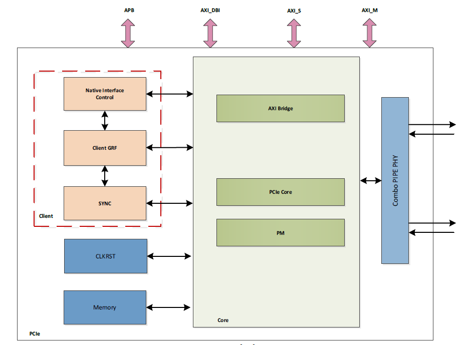
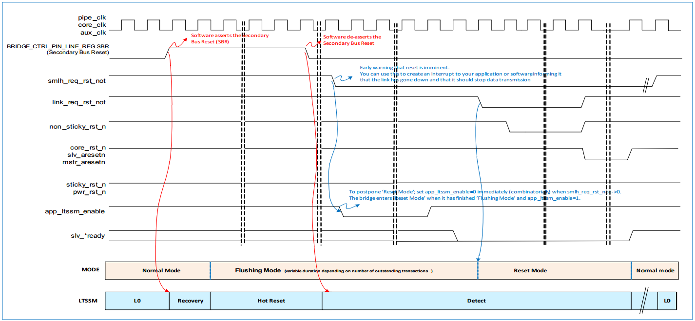
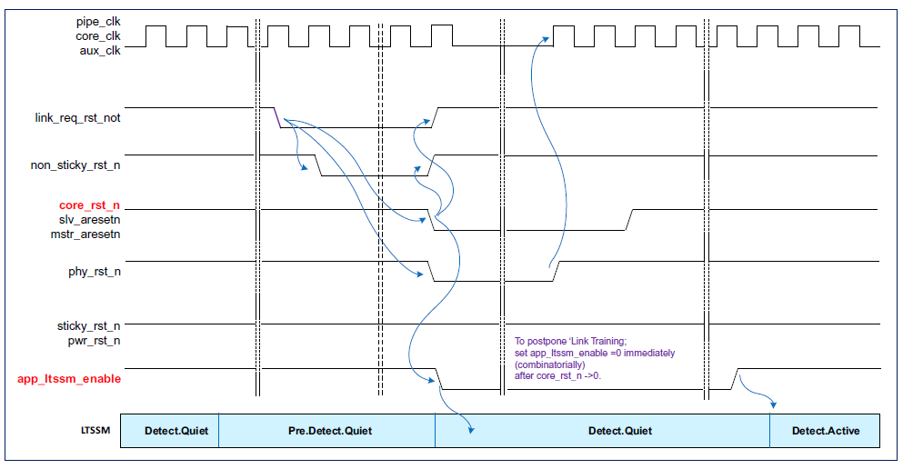

# RK3576 PCIe Controller
## Block Diagram

圖片來源： rk3576 TRM 下載自 https://github.com/DeciHD/rockchip_docs.git

* `APB`: APB 介面. 主要是讓系統可以讀寫Client的暫存器.
* `AXI_S`: AXI Slave 介面。主要是讓系統可以透過 AXI Bridge 去讀寫遠端的 PCIe 裝置。
* `AXI_M`: AXI Master 介面。 主要是讓遠端的 PCIe 裝置透過 AXI Bridge 去讀寫系統。
* `AXI_DBI`: AXI Slave 介面。 主要是讓系統可以透過這個介面去讀寫控制 Controller。
* `Client`: Client 邏輯區塊。
* `CLKRST`: Clock 和 Reset 相關邏輯區塊。
* `Memory`: SRAMS 和 Buffers。
* `AMBA Bridge`: AXI 介面和 核心控制區塊的橋樑。
* `PCIe Core`: PCIe 控制核心區塊。
* `PM`: 電源控制單元。
* `Combo PIPE PHY`

----

## Function Description
### Application Interface and AXI Bridge
* 主要有四個介面: 一個 `AXI Master` ， 兩個 `AXI Slave` (`AXI_S` 、 `AXI_DBI` )和一個 `APB` 。
* AXI Bridge : AXI 介面和 PCIe 控制器中間的橋樑。
* AXI Slave : 讓本地端系統讀寫遠端 PCIe 裝置。
* AXI Master: 讓遠端 PCIe 裝置讀寫本地端系統。
* AXI DBI: 讓本地系統去讀寫 PCIe 控制器。

----

### Client
* 讓系統能夠透過讀寫 Client 的暫存器來對 PCIe 控制器做一些額外的操作。
* 傳送/接收 PCIe Message。
* 要求控制器進入或離開 PM 狀態。
* 處理中斷。
* 設定基本的運行模式。
* 讀取 Debug 訊息。

----

### CXPL
* PCIe 控制器處理了 PCIe 的協定，主要包含三個部分。
* Transaction Layer -> TLP。
* Data Link Layer -> DLLP。
* Physical Layer -> Physical Packet ， LTSSM ( Link training and status state machine)。
* PCIe Core 與外部的 PHY 透過標準 PIPE 介面相連。

----

### PMC
* 支援 **PCIe ASPM**（主動狀態省電機制）:
	* L0 (正常傳輸)。
	* L0s (快速省電)。
	* L1 (深度省電)。
* 支援 **L1 Substate**（L1 低功耗子狀態）:
	* L1.1 (降低 PHY 功耗)。
	*  L1.2 (幾乎關閉 PHY + 參考時鐘)。
* 支援 **PCI PM**（PCI 電源管理）:
	* D0 (工作中)。
	* D1 / D2 (部分省電)。 
	* D3 (關機 / 睡眠)。

----

### XADM (Transmit Application-Dependent Module)
* TLP 仲裁（TLP Arbitration）。
* TLP 封裝（TLP Formation）。
* 流量控制（Flow Control）額度檢查（FC Credit Checking）。
* 採用 cut-through 架構（不做完整緩衝延遲）。
* 不包含傳送端緩衝區/佇列（除了 `重傳緩衝區`）。
* 重傳緩衝區主要是儲存的是已送出的 TLP 資料（含 Header + Payload），直到收到對應的 ACK 如果在 Timeout 內沒收到 ACK（或收到 NAK），控制器就會用 Retry Buffer 重新發送該封包。
* 控制器內部維護 `Target Completion Lookup Table`，用來儲存從接收端（Rx）請求取得的部分 TLP 標頭資訊。
* Target Completion Lookup Table 的主要用途是在 Transmit 端 儲存**從接收端收到的 Memory Read Request（或其他需要回應的 TLP）**的部分 TLP Header 資訊。當控制器要回傳 Completion TLP 時，就能查這張表，找到原始 Request 的 Tag、Requester ID 和長度、地址對齊資訊等。這樣才能正確形成 Completion 封包，保證與原始 Request 匹配。

----

### RADM (Receive Application-Dependent Module)
* TLP 排序/過濾
	* 對接收到的 TLP 進行篩選和路由
	* 過濾規則和路由可配置
* TLP 緩衝與排隊
	* 對接收的 TLP 進行暫存與排隊管理
* 路由至控制器接收介面
	* 將 TLP 導向 PCIe 控制器的各接收介面
* 維護 **Receive Completion Lookup Table（LUT）** 用於追蹤 **Tx non-posted Request** 的 Completion 。監控 Completion Timeout：若預期的 Rx Completion 未在超時時間內到達，則觸發 Timeout 指示。

---

### CDM (Configuration-Dependent Module)
我幫你整理成中文重點如下：

---

**Configuration-Dependent Module（CDM）**
* 標準 PCI Express 配置空間（Standard Configuration Space）。提供 PCIe 規範定義的配置寄存器。
* 控制器專屬寄存器空間（Controller-specific / Port Logic Registers）。提供控制器或 Port 的額外自訂寄存器。用於管理內部邏輯、狀態或特定功能。

---

## Register Description

| Base Address | Name | Device | Address Length | Offset Address Range |
|--------------|------|--------|---------------|---------------------|
| 0x22000000 | PCIe2_1L0_DBI/PCIE0_DBI | Core Register | 4M BYTE | 0x00000 ~ 0x3ffff |
| 0xa00000000 | PCIe2_1L0_DBI/PCIE0_DBI | Core Register | 4M BYTE | 0x00000 ~ 0x3ffff |
| 0x20000000 | PCIe2_1L0_S/PCIE0_S | PCIe Outbound Memory | 16M BYTE | 0x00000000~0xffffff |
| 0x900000000 | PCIe2_1L0_S/PCIE0_S | PCIe Outbound Memory | 2G BYTE | 0x00000000~0x7ffffff |
| 0x2A200000 | PCIe2_1L0_APB/PCIE0_APB | Client Register | 64K BYTE | 0x0000~0xffff |
| 0x22400000 | PCIe2_1L1_DBI/PCIE1_DBI | Core Register | 4M BYTE | 0x00000 ~ 0x3ffff |
| 0xa00400000 | PCIe2_1L1_DBI/PCIE1_DBI | Core Register | 4M BYTE | 0x00000 ~ 0x3ffff |
| 0x21000000 | PCIe2_1L1_S/PCIE1_S | PCIe Outbound Memory | 16M BYTE | 0x00000000~0xffffff |
| 0x980000000 | PCIe2_1L1_S/PCIE1_S | PCIe Outbound Memory | 2G BYTE | 0x00000000~0x7ffffff |
| 0x2A210000 | PCIe2_1L1_APB/PCIE1_APB | Client Register | 64K BYTE | 0x0000~0xffff |

* **PCIe2_1L0_DBI/PCIe0_DBI**：PCIe 資料庫介面 (Database Interface)
* **PCIe2_1L0_S/PCIe0_S**：PCIe 從屬 (Slave) 介面
* **PCIe2_1L0_APB/PCIe0_APB**：APB (Advanced Peripheral Bus) 介面

----

## Application Notes

### Clock and Reset

#### Clock Overview

| Clock Name | Note |
|------------|------|
| pclk/core_clk/pipe_clk | PIPE and Core clock from PHY PLL generated |
| mstr_aclk | AXI master clock |
| slv_aclk | AXI slave clock |
| dbi_aclk | DBI AXI slave clock |
| aux_clk | Low power clock(XIN OSC clock) |
| apb_clk | APB slave clock for Client |

##### DeviceTree
```dts
	pcie0: pcie@2a200000 {
		...
		
		clocks = <&cru ACLK_PCIE0_MST>, <&cru ACLK_PCIE0_SLV>,
			 <&cru ACLK_PCIE0_DBI>, <&cru PCLK_PCIE0>,
			 <&cru CLK_PCIE0_AUX>;

		clock-names = "aclk_mst", "aclk_slv",
			      "aclk_dbi", "pclk",
			      "aux";
		...
	};
```
* **aclk_mst**: PCIe 作為 AXI Master 時的時脈，用於發起記憶體存取
* **aclk_slv**: PCIe 作為 AXI Slave 時的時脈，用於接收配置存取
* **aclk_dbi**: Database Interface 的時脈，用於核心暫存器存取
* **pclk**: APB (Advanced Peripheral Bus) 時脈，用於低速控制暫存器存取
* **aux**: 輔助時脈，通常用於電源管理和低功耗狀態

* **PIPE 介面時脈** - 由 PHY 提供，透過 `phys` 屬性管理。所以沒在 device tree 中出現。

##### 關鍵重點說明
1. **驅動程式初始化時**：按順序啟用所有五個時脈
2. **低功耗管理**：可以選擇性關閉部分 AXI 時脈
3. **錯誤處理**：確保時脈穩定後再存取 PCIe 暫存器
4. **PHY 整合**：協調 Device Tree 時脈與 PHY 提供的時脈

* **時脈切換機制**
	- **正常運作**：核心功能時脈 = PIPE 介面時脈
	- **低功耗狀態**：核心功能時脈被閘控，自動切換至電源管理時脈
	- **系統保護**：PHY 未就緒時，AXI 存取會被暫停直到 PHY 準備完成

* **啟動順序要求**
	1. **PHY PLL 必須先鎖定** - 所有 PCIe 操作的前提條件
	2. **確認 phystatus 訊號** - 表示 PHY 已準備就緒
	3. **應用程式才能開始交易** - 避免在 PHY 未準備時操作

* **程式設定需求**
	- **L1_SUBSTATES_OFF 暫存器**：必須設定為 XIN OSC 時脈頻率值
	- **用途**：讓 PCIe 控制器能正確計算 L1 子狀態的實際時間

* **參考時脈同步**
	- **背板連接特別重要**：需要同步參考時脈
	- **REFCLK 要求**：PCIe 連結兩端必須使用共同的時脈源
	- **目的**：確保連結穩定性和訊號完整性

* **關鍵限制**
	- PHY PLL 未鎖定前，**禁止**啟動任何 PCIe 交易
	- phystatus 未釋放前，AXI 存取會被**自動暫停**
	- L1 子狀態計時需要**正確的頻率設定**
* **最佳實務**
	- 開機時先檢查 PHY 狀態再進行配置
	- 確保參考時脈的穩定性和同步性
	- 正確設定電源管理時脈頻率值

#### Reset Overview

##### **Power-On Reset (冷重置)**
* **觸發源**: Power-on Reset (上電重置)
* **作用範圍**: 整個 PCIe 模組
* **重置對象**: PCIe Core + PCIe PHY
* **重置信號**: 產生 `phy_rst_n` 信號重置 PHY 連結
* 重置時序流程

| 階段 | 狀態 | 說明 |
|------|------|------|
| **1. 上電階段** | Power-on Reset 被觸發 | 整個模組進入重置狀態 |
| **2. 重置保持** | CRU 控制重置信號 | 軟體尚未釋放重置 |
| **3. PHY 初始化** | 軟體初始化 PHY | **關鍵步驟：必須在釋放重置前完成** |
| **4. 重置釋放** | 軟體釋放重置請求 | PCIe PHY 和 Core 開始正常運作 |

##### **System reset**
* PCIe 控制器提供 **8 種不同的重置信號**，全部可透過軟體驅動程式配置。
* **button_rst_n - 按鈕重置** 
	- **來源**: 板子上的按鈕重置（如果相關 IO 被使用）
	- **功能**: 等同於 Power-on Reset 的功能
	- **重置類型**: Cold Reset
	- **影響範圍**: 整個 PCIe 模組

* **perst_n - PCIe 重置**
	- **來源**: PCIe 規範定義的重置信號（如果相關 IO 被使用）
	- **功能**: 作為 PCIe 的 Warm Reset
	- **重置類型**: Warm Reset
	- **影響範圍**: PCIe 連結層級重置

* **core_rst_n - 核心重置**
	- **功能**: PCIe 控制器的主要重置信號
	- **影響範圍**: 
  	- ✅ CORE_CLK 域的所有邏輯
  	- ✅ PCLK 域的部分邏輯
  	- ❌ PMC 模組**不受影響**
	- **預設行為**: 隨 Power-up Reset 保持重置狀態
	- **特殊用途**: Hot Reset 或 Link Down Reset 時也會被觸發
	- **軟體控制**: 應用軟體可以延遲重置，直到系統準備好執行核心重置

* **三個獨立的 AXI 重置信號**:

	| 重置信號 | 影響範圍 | 時脈域 |
	|----------|----------|--------|
	| **mstr_aresetn** | AXI Master 介面邏輯 | AXI Master 時脈域 |	
	| **slv_aresetn** | AXI Slave 介面邏輯 | AXI Slave 時脈域 |
	| **dbi_resetn** | DBI AXI 介面邏輯 | DBI 時脈域 |

	- 通常隨 `core_rst_n` 一起被觸發
	- 應用軟體需要選擇適當時機驅動重置
	- **避免在交易進行中執行重置**

* **non_sticky_rst_n - 非黏性位元重置**
	- **功能**: 重置配置暫存器空間中的非黏性位元暫存器
	- **特性**: 這些暫存器在正常重置時會回到預設值
	- **sticky**（黏性）的，也就是說它們的值會在某些重置操作後保持不變。

* **sticky_rst_n - 黏性位元重置**
	- **功能**: 重置配置暫存器空間中的黏性位元暫存器
	- **特性**: 這些暫存器通常在正常重置時保持其值

* **pwr_rst_n - 電源重置**
	- **功能**: 重置 PMC (Power Management Controller) 模組
	- **影響範圍**: 
  	- ✅ PM 時脈域的所有暫存器
  	- ✅ 包含黏性位元
	- **本質**: 就是 Power-on Reset

* **phy_rst_n - PHY 重置輸出**
	- **方向**: 輸出信號（控制器 → PHY）
	- **功能**: 重置 PCIe PHY
	- **觸發條件**: 以下任一重置都會觸發
		- Cold Reset
		- Warm Reset  
		- Hot Reset

##### **Hot Reset and Link-Down Reset**

* **Hot Reset 觸發**
	- **發起者**: Downstream Port (DSP) 
	- **機制**: 發送兩個連續的 TS1 ordered sets，且 Hot Reset 位元被設置
	- **接收者**: Upstream Port (USP)
	- **結果**: 雙方都會觸發 `link_req_rst_not` 信號

* **Link-down Reset 觸發**
	- **原因**: 正常運作期間連結失效
	- **偵測**: 控制器偵測到連結中斷事件
	- **處理**: 控制器請求重置模組執行 Hot Reset

* Hot Reset 和 Link-down Reset 的處理方式**完全相同**

* Hot Reset 或 Link-down Reset 啟動前必須確保：
	- 系統匯流排上沒有待處理的傳送
	- 應用軟體必須確認系統匯流排處於 IDLE 狀態
	- 所有進行中的傳送都被乾淨地終止

* **自動清空機制**：
	- **AXI 分段緩衝區 Rx 佇列架構**：控制器會自動執行清空程序
	- **停用方法**：設定 `LINK_FLUSH_CONTROL_OFF` 中的 `AUTO_FLUSH_EN` 為 '0'

###### 📊 時序圖分析

* **Hot Reset 完整流程**
	
	- **階段1: 早期警告**
	```
	smlh_req_rst_not 被觸發 → 產生中斷 (link_req_rst_not_int)
	```
	- **階段2: 延遲機制 (可選)**
	```
	設定 app_ltssm_enable = 0 → 暫停 LTSSM → 延遲重置
	```
	- **階段3: 重置執行**
	```
	core_rst_n, slv_aresetn, mstr_aresetn 被觸發
	```
	- **階段4: 重置完成**
	```
	進入 Reset Mode → 返回 Normal Mode
	```
	- **延遲機制1: app_dly1_en (重置前延遲)**
	
	
	圖片來源： rk3576 TRM 下載自 https://github.com/DeciHD/rockchip_docs.git

	**目的**: 延遲控制器重置，讓它繼續接受和終止 slave 請求

	**實現步驟**：
	1. **觸發條件**: `smlh_req_rst_not` 變為低電平後
	2. **立即動作**: 設定 `app_ltssm_enable = 0` (組合邏輯)
	3. **啟用延遲**: 啟用 `app_dly1_en`
	4. **LTSSM 停止**: `app_ltssm_enable` 立即取消設定
	5. **軟體處理**: 設定 PCIe BIU 為 IDLE 狀態
	6. **結束延遲**: 觸發 `app_dly1_done`
	
	**應用場景**：
	- 需要透過 DBI 讀取暫存器狀態
	- 需要乾淨地終止進行中的交易

	- **延遲機制2: app_dly2_en (重置後延遲)**
	
	
	圖片來源： rk3576 TRM 下載自 https://github.com/DeciHD/rockchip_docs.git


	**目的**: 延遲連結重新建立，允許透過 DBI 重新程式設定暫存器

	**實現步驟**：
	1. **觸發條件**: `core_rst_n` 重置完成後
	2. **立即動作**: 設定 `app_ltssm_enable = 0`
	3. **啟用延遲**: 啟用 `app_dly2_en`
	4. **軟體重配**: 透過 DBI 重新程式設定暫存器
	5. **結束延遲**: 觸發 `app_dly2_done`

	**應用場景**：
	- 需要在連結重新建立前重新配置 PCIe 參數
	- 系統特定的初始化需求

### Initialization
1. **IO 信號配置**
	* **配置必要的 IO 信號**
	* `CLKREQ#` 和 `WAKE#` 信號配置
	* **可選信號**（如果使用）：
		* `button_rst_n` - 按鈕重置
		* `perst_n` - PCIe 重置
	**目的**: 建立基本的硬體控制介面

2. **CRU 時脈配置**
	**配置時脈重置單元 (CRU) 暫存器**
	- 為 PCIe PHY 提供適當的參考時脈（如使用內部參考）
	- 檢查所有 CRU 控制暫存器：
		- **PLL** - 鎖相迴路設定
		- **DIV** - 分頻器配置
		- **CKG** - 時脈閘控設定
	- 確保參考時脈和其他時脈正常工作
	**目的**: 建立穩定的時脈基礎

3. **Combo PIPE PHY 配置**
	**配置 Combo PIPE PHY 通用暫存器檔案**
	- 設定 PHY 工作模式
	- 控制未使用的 PIPE 信號
	- 初始化 PHY
	- 配置參考時脈源或輸出差動參考時脈
	**目的**: 準備 PHY 硬體介面

4. **PHY 類比調整 (可選)**
	**配置 PHY 內部暫存器**
	- 調整類比修整參數 (analog trim)
	- 根據具體應用需求微調 PHY 效能
	**目的**: 優化 PHY 電氣特性

5. **釋放 PCIe 控制器重置**
	**啟動 PCIe 控制器**
	- 取消 PCIe 控制器的 power-up reset
	- **等待穩定**：
		- 延遲一段時間，或
		- 等待 PLL 鎖定（如果 PLL 鎖定旗標可存取）
	**目的**: 啟動 PCIe 控制器核心功能

6.	**啟用增強控制模式**
	**設定控制模式**
	```
	app_ltssm_enable_enhance = 1
	```
	- 啟用 `app_ltssm_enable` 的增強控制模式
	- 提供更精細的 LTSSM 控制能力
	**目的**: 啟用進階控制功能

7. **連結訓練初始化**
	**設定裝置類型**
	```
	device_type = Root Complex
	```
	**建議設定**
	```
	direct_speed_change = 1  // 在 PL_GEN2_CTRL_OFF 中設定
	```
	**強烈建議**在連結訓練前設定此位元

	**啟動連結訓練**
	```
	ltssm_enable = 1  // 在 PCIE_CLIENT_GENERAL_CON 中設定
	```

	**監控連結狀態**
	| 狀態指標 | 意義 | 監控方式 |
	|----------|------|----------|
	| `phy_link_up_int = 1` | 連結訓練成功 | 輪詢或中斷 |
	| `dll_link_up_int = 1` | 資料流初始化成功 | 輪詢或中斷 |

	**監控暫存器**：
	- `LTSSM_STATUS`
	- `GENERAL_DEBUG_INFO`

	**連結優化**：
	- 控制器會嘗試以最大連結寬度/速度建立連結
	- 如需調整速度或 lane 數，請參考內部應用文件

8. **軟體模擬和初始化**
	**執行軟體層初始化**
	- 軟體模擬相關設定
	- 系統特定的初始化程序

	**目的**: 完成軟體層面的準備工作

9. **啟用匯流排功能**
	**最後的啟用步驟**
	```c
	// 寫入控制暫存器
	Bus Master Enable (BME) = 1;     // 啟用匯流排主控功能
	Memory Space Enable (MSE) = 1;   // 啟用記憶體空間存取
	```

### Address Translation
iATU 由控制器提供，用來做 **本地位址轉換 (local address translation)**。它會 **修改 TLP request header 中的位址和其他欄位**。共有兩種區域 **Inbound Address Translation Regions** 和 **Outbound Address Translation Regions** 。分別處理從 **PCIe → 本地匯流排**，以及 **本地匯流排 → PCIe** 的位址轉換。區域大小的限制最小為**64 KB**，**4 GB**。

#### Outbound Features
* **Address Match Mode**：針對 MEM / I/O / CFG / MSG TLP 進行位址比對與轉換。
* **Completion 不會被轉換**。
* **TLP Header 欄位替換 (Programmable Replacement)**

  * TYPE, TC, AT, ATTR, MSG-Code, TH, PH, ST
* **支援 16 個 region**，每個 region 可設定位置與大小 (64 KB ～ 4 GB)。
* **Region 可獨立啟用/關閉**。
* **FMT 自動轉換**：對 64-bit 位址，自動在 3DW / 4DW header 間轉換。
* **Invert Address Match Mode**：翻轉比對條件 → 可轉換 **未命中區域** 的存取。
* **Configuration Shift Mode**：最佳化多功能裝置 (multifunction device) 的 CFG 存取記憶體使用。
* **Response Code 設定**：定義存取該 region 時返回的 Completion 狀態。
* **Payload Inhibit**：將所有 TLP 標記為 **無 payload**。
* **Header Substitution**：可替換 outbound TLP header 特定位元組 (3DW 的 8–11 bytes / 4DW 的 12–15 bytes)。
* **Tag Substitution**：支援替換 outbound TLP 的 Tag。
* **Function Number Bypass Mode**：允許從 Tx 介面直接提供 Function Number，同時仍能進行其他轉換。
* **DMA Bypass Mode**：允許 DMA 產生的 TLP **直接通過，不經轉換**。

#### Outbound Basic Operation
* 每個 **MEM / I/O TLP** 的 address 會檢查是否落在 iATU 定義的 **啟用區域 (Start–End)** 內。若 **有符合**，則進行轉換。轉換公式如下：
	```
	Translated Address = Original Address - Base Address + Target Address
	```
* 以下欄位會根據 `IATU_REGION_CTRL_1_OFF_OUTBOUND_0` 的設定被替換：
	* TYPE
	* TC
	* AT
	* TH
	* PH
	* ST
	* Function Number
	* ATTR

* 若有多個區域同時比對成功，**編號最小 (region 0 開始)** 的那個會被採用。
* 若沒有任何 address region 匹配，則依據 **No Address Match Result** 規則處理。
**最小區域大小：64 KB**
   * **對齊需求：64 KB 邊界**
   * 因此 **Base / Limit / Target Register 的低 16 bits = 0**。

#### Outbound Detailed Operation
##### RID BDF Number Replacement
當**Outbound TLP 成功進行地址匹配**時，系統會執行以下操作：
* Function Number 來源
	- **Function Number** 是從 `IATU_REGION_CTRL_1_OFF_OUTBOUND_i` 暫存器的 **3-bit Function Number 欄位**中取得
	- 這個 Function Number 用於生成 TLP 的 **Requester ID 欄位中的 Function 部分**

* 重要限制
	- 除非控制器啟用了**多功能操作 (multifunction operation)**，否則此欄位的值**必須為 0x0**

* 覆寫選項
	- 可以使用 **"Function Number Translation Bypass Feature"** 來覆寫這個預設行為

##### iATU Outbound MSG Handling
**iATU 支援將 MEM 和 I/O TLP 轉換為 Msg/MsgD TLP**
* 應用目的
	- 支援**無法直接生成 Msg/MsgD TLP 的應用程式**
	- 提供間接的訊息傳送機制
* 轉換條件
	當同時滿足以下條件時會進行轉換：
	1. **Outbound MEM TLP 成功進行地址匹配**
	2. **轉換後的 TLP type 欄位為 MSG**（即 `IATU_REGION_CTRL_1_OFF_OUTBOUND_i` 暫存器的 type 欄位為 `10xxx`）

* Message Code 設定
	- TLP 的 **message code 欄位**會被設定為 `IATU_REGION_CTRL_2_OFF_OUTBOUND_i` 暫存器中 **Message Code 欄位的值**

* 轉換規則
	- **有效長度為 '0' 的 Memory Write** → 轉換為 **Msg**
	- **所有其他的 MWr (Memory Write) TLP** → 轉換為 **MsgD**


##### MEM-CFG Type Translation
**iATU 支援將 I/O 和 MEM TLP 轉換為 CFG TLP**

* 應用目的
	- 支援**無法生成 CFG TLP 的應用程式**
	- 提供間接的配置空間存取機制

* BDF 位置與計算
	**16-bit BDF 位於轉換後地址的 [31:16] 位元**

* 地址轉換公式
	```
	Translated Address = Original Address - Base Address + Target Address
	```

* 實際範例
	```
	Original Address[31:16] = {13h0, function_no[2:0]}
	Base Address[31:16] = 16h0
	Target Address[31:16] = {bus_no[7:0], device_no[4:0], 3h0}

	結果：
	Translated Address[31:16] = BDF = {bus_no[7:0], device_no[4:0], function_no[2:0]}
	```

* 區域大小建議
	- 要處理 **8 個功能**，應使用 **19-bit 寬的區域大小**
	- 這樣可以涵蓋所有可能的 function number (0-7)

* 重要注意事項
	對於**應用程式直接建立的 CFG 交易**（非透過 iATU）：
	- 必須確保 **BDF 欄位不匹配任何已程式化的 iATU 地址區域**
	- 避免發生**意外的 type translation**


##### CFG Shift Feature
* 啟用方式
	- 透過設定 `IATU_REGION_CTRL_2_OFF_OUTBOUND_0` 暫存器中的 **CFG_SHIFT_MODE 欄位**來啟用

* 核心機制
	**iATU 使用原始地址的 [27:12] 位元來形成 Outbound CFG TLP 的 [31:16] 位元（BDF 位置）**

* 位元映射
	```
	Original Address[27:12] → Outgoing CFG TLP[31:16] (BDF location)
	```

* 支援的標準
**支援 Enhanced Configuration Address Mapping (ECAM) 機制**

* 功能效果
	- 允許所有**已轉換為 CFG 的 outbound I/O 和 MEM TLP**
	- 從**記憶體空間**映射到 **PCIe 配置空間的任意 256 MB 區域**

* 地址空間計算
	- 16 位元的 BDF (Bus Device Function) = 2^16 = 64K 個可能的設備
	- 每個設備的配置空間 = 4KB
	- 總配置空間 = 64K × 4KB = 256 MB

##### FMT Translation
這段文字描述的是 **iATU 自動 TLP 格式設定機制**。以下是重點整理：

## 自動格式檢測機制
**iATU 會根據轉換後地址的格式自動設定 TLP format 欄位**
* 3 DWORDs 格式
	- **條件**：檢測到轉換後地址的**上 32 位元全為零**
	- **結果**：設定為 **3 DWORDs** 格式
	- **意義**：32-bit 地址格式

* 4 DWORDs 格式
	- **條件**：檢測到 **64-bit 地址**（即轉換後地址的上 32 位元中有 '1'）
	- **結果**：設定為 **4 DWORDs** 格式
	- **意義**：64-bit 地址格式

* 格式一致性保證
	**當原始地址和轉換後地址格式不同時**：
	- iATU 確保 **TLP header 大小匹配轉換後地址的格式**
	- 自動調整 header 結構以符合目標格式

##### Invert Feature
* Invert Feature 啟用後 **地址匹配條件**：未轉換地址**不在** base address 和 limit address 所界定的區域內
```
Untranslated Address < Base Address 或 Untranslated Address > Limit Address → 匹配
```
* 啟用方式
透過設定 `IATU_REGION_CTRL_2_OFF_OUTBOUND_i` 暫存器中的 **Invert 欄位**

##### DMA Bypass Feature
**當不希望 iATU 轉換由 DMA 產生的出站請求時**
* 兩種實作方法
	- 方法一：程式配置控制
	**確保 DMA 通道地址程式設計和 iATU 控制暫存器程式設計的組合不會在 iATU 中進行 DMA 流量轉換**
	- 方法二：DMA Bypass 模式
	**啟用 DMA bypass 模式，讓嵌入式 DMA 控制器發起的請求 TLP 不經轉換直接通過 iATU**
	透過設定 `IATU_REGION_CTRL_2_OFF_OUTBOUND_i` 暫存器中的 **DMA Bypass 欄位為 1**

##### Function Number Translation Bypass Feature
**在此模式下，轉換後 TLP 的 function number 來源改變**
* 正常模式
	- **來源**：`REGION_CTRL_1_OFF_OUTBOUND_i` 暫存器的 **Function Number 欄位**
	- **特點**：靜態設定，由暫存器預先定義

* Bypass 模式
	- **來源**：**應用程式傳送介面**
	- **特點**：動態提供，由應用程式即時指定

* 啟用方式	
透過設定 `IATU_REGION_CTRL_2_OFF_OUTBOUND_i` 暫存器中的 **Function Number Translation Bypass Enable 欄位為 '1'**

##### General Bypass
**應用程式可以程式化 `PCIE_CLIENT_AXI_SLV_ATU_BYPASS` 暫存器來執行通用 ATU 旁路**
重要注意事項: **在程式化此暫存器之前，必須確保沒有傳輸正在進行中**


##### Header Substitution (Tx)
**當啟用且區域地址匹配時，iATU 會完全替換出站 TLP 標頭的特定位元組**

* 替換位置
	- **3 DWORD 標頭**：替換位元組 8-11
	- **4 DWORD 標頭**：替換位元組 12-15

* 替換內容來源
**`IATU_LWR_TARGET_ADDR_OFF_OUTBOUND_i` 暫存器中的 LWR_TARGET_RW 欄位**

* 啟用方式
透過設定 `IATU_REGION_CTRL_2_OFF_OUTBOUND_i` 暫存器中的 **HEADER_SUBSTITUTE_EN 欄位**

* 主要應用
	- **Vendor Defined Msg/MsgD transaction**
	- **ATS (Address Translation Services) transaction**

##### Tag Substitution (Tx)
**當啟用且區域地址匹配時，iATU 會替換 outbound TLP 標頭的 TAG 欄位**

* 替換內容來源
**`IATU_REGION_CTRL_2_OFF_OUTBOUND_i` 暫存器中的 TAG 欄位**

* 啟用方式
透過設定 `IATU_REGION_CTRL_2_OFF_OUTBOUND_i` 暫存器中的 **TAG_SUBSTITUTE_EN 欄位**

* 預期使用場景
	**從 AXI MWr (Memory Write) 轉換為 Vendor Defined Msg/MsgD**
	- 將標準記憶體寫入操作轉換為廠商定義的訊息
	- 支援特殊的通訊協定需求

* 重要限制
**應用程式不得嘗試對 outbound non-posted TLP 執行 TAG 替換**

* 注意事項
**所有可能匹配該 TLP 的區域，其 `IATU_REGION_CTRL_2_OFF_OUTBOUND_i` 暫存器中的 Function Number Translation Bypass 欄位必須相同**

#### Outbound Programming Example
* 目標設定
**定義 Outbound Region 1**：
- **來源區域**：64 KB I/O 區域，從 `0x80000000_d0000000` 到 `0x80000000_d000ffff`
- **目標位置**：映射到 PCIe I/O 空間的 `0x00010000`

* 程式設定步驟
	1. 設定區域基底和限制地址暫存器
	```
	Address {0x208} ← 0xd0000000  (Lower Base Address)
	Address {0x20C} ← 0x80000000  (Upper Base Address)  
	Address {0x210} ← 0xd000ffff  (Limit Address)
	```

	2. 設定目標地址暫存器
	```
	Address {0x214} ← 0x00010000  (Lower Target Address)
	Address {0x218} ← 0x00000000  (Upper Target Address)
	```

	3. 透過 Region Control 1 暫存器配置區域
	```
	Address {0x200} ← 0x00000002  (定義區域類型為 I/O)
	```

	4. 啟用區域
	```
	Address {0x204} ← 0x80000000  (啟用區域)
	```

	地址計算驗證
	- **區域大小**：`0xd000ffff - 0xd0000000 + 1 = 0x10000 = 64 KB` ✓
	- **64-bit 來源地址**：`0x80000000_d0000000` (需要 Upper Base Address)
	- **32-bit 目標地址**：`0x00010000` (Upper Target Address = 0)

	關鍵配置值
	- **區域類型**：`0x00000002` = I/O 類型
	- **啟用位元**：`0x80000000` = 最高位元設為 1 啟用區域

	實際效果
	任何存取 `0x80000000_d0000000` 到 `0x80000000_d000ffff` 範圍的 I/O 操作，都會被轉換為存取 PCIe I/O 空間的 `0x00010000` 到 `0x0001ffff` 範圍。

#### Inbound Features
**地址轉換用於將不同地址範圍映射到應用程式支援的不同記憶體空間**
- 典型範例：將應用程式記憶體空間映射到 PCI 記憶體空間
- 支援類型轉換
- 無需外部邏輯即可實作自訂 inbound 地址轉換方案

1. 可程式匹配模式
	- **支援 TLP 類型**：MEM、I/O、CFG、MSG
	- **注意**：Completion 不進行轉換

2. 可選擇的 BAR 匹配模式
	**適用於 I/O 和 MEM TLP**：
	- 目標為內部 CDM（或 ELBI）的上游埠 TLP 不進行轉換
	- 有錯誤的 TLP（ECRC、格式錯誤等）不進行轉換

3. 可程式 TLP 標頭欄位匹配
	**支援欄位**：TYPE/TD/TC/AT/ATTR/MSG-Code/TH/PH/ST
	**其他**：Function Number

4. 多重地址區域支援
	- 位置和大小可程式設定
	- 每個區域可個別啟用/停用

5. 自動格式轉換
	**64-bit 地址的 FMT 欄位自動在 3 DWORD 和 4 DWORD 間轉換**

6. 特殊模式
	- **反轉地址匹配模式**：轉換成功地址匹配外的存取
	- **ECAM 配置位移模式**：允許 256 MB CFG1 空間位於 64-bit 地址空間的任何位置

7. 區域大小支援
	**從 64 KB 到 4 GB**

8. 單一地址位置
	**允許所有 TLP 轉換到單一地址位置**

9. 訊息類型匹配模式
	**允許匹配任何 Message 類型的 TLP**


#### Inbound Basic Operation
